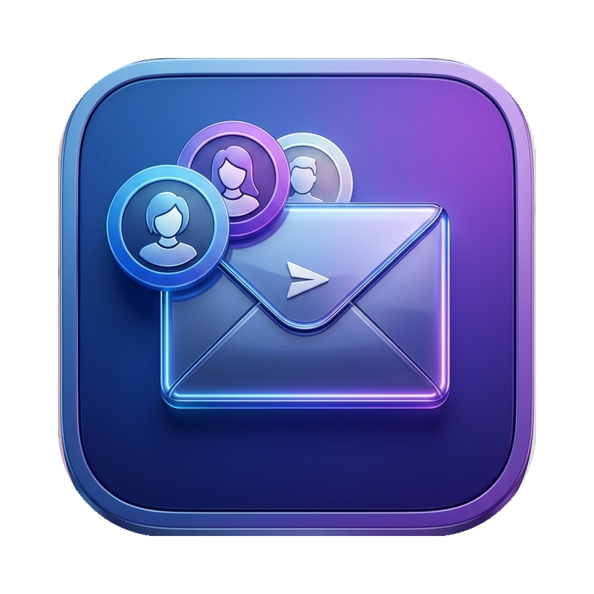

# 📬 OWA Accounts — Multi-Account OWA Desktop Application

[English](#english) | [Русский](#русский)

---

## English

<p align="center">
  
</p>

<p align="center">
  <strong>A premium, native-like macOS desktop application for managing multiple Outlook Web Access (OWA) accounts simultaneously with complete session isolation.</strong>
</p>

<p align="center">
  
  
  
</p>

### ✨ Features

*   **⚡ Multi-Account support:** Add, configure, and switch between multiple OWA accounts with a single click or keyboard shortcuts.
*   **🔒 Complete Session Isolation:** Each account runs in its own partition (`persist:owa-{id}`), keeping cookies, localStorage, and authentication sessions isolated to prevent leaks or account crossovers.
*   **🔔 Unread Count & Dock Badges:** Automatically monitors and counts unread messages across all accounts, updating the system Dock icon and the menubar tray badge in real-time.
*   **🎨 Custom Visual Identity:** Assign custom colors and names to each account to keep work and personal workspaces visually distinct.
*   **🌑 Smart Dark Mode:** Built-in support for native dark theme matching, with advanced custom css overrides.
*   **🎹 Global Keyboard Shortcuts:**
    *   `Cmd+N`: Add a new account.
    *   `Cmd+R`: Refresh current account view.
    *   `Cmd+W`: Close window (runs securely in the background menu bar).
    *   `Cmd+Q`: Safely quit application.

---

### 🚀 Getting Started

#### Prerequisites
*   **Node.js** (v18.0.0 or higher recommended)
*   **npm** (v9.0.0 or higher)

#### Installation & Development
1.  **Clone the repository:**
    ```bash
    git clone https://github.com/YOUR_USERNAME/mail_owa.git
    cd mail_owa
    ```
2.  **Install dependencies:**
    ```bash
    npm install
    ```
3.  **Run in development mode:**
    ```bash
    npm run dev
    ```

#### Building the Application
To build a standalone production bundle for macOS:
```bash
# Build production bundle
npm run build

# Package for macOS (creates a universal dmg file)
npm run build:mac
```
The packaged application will be generated in the `./dist-electron` folder.

---

### 🛡️ Security & Privacy
*   **Zero Password Storage:** Passwords can be optionally supplied for webview auto-fill, or left blank to use standard OWA web login form securely.
*   **Sandboxed Environment:** Webviews are securely isolated with `contextIsolation` enabled and node integration disabled.
*   **Data Location:** All configurations and account metadata are saved locally on your machine in:
    `~/Library/Preferences/com.owa.accounts.plist`

---

## Русский

<p align="center">
  <strong>Удобное и стильное macOS-приложение для одновременной работы с несколькими учетными записями Outlook Web Access (OWA) с полной изоляцией сессий.</strong>
</p>

### ✨ Основные возможности

*   **⚡ Мультиаккаунтность:** Добавляйте и переключайте несколько ящиков OWA в один клик.
*   **🔒 Изоляция сессий:** Каждый аккаунт работает в своем изолированном контейнере (`persist:owa-{id}`), исключая конфликты cookie и авторизаций.
*   **🔔 Интеграция с macOS:** Отображение счетчика непрочитанных писем на иконке в Dock и в системном трее.
*   **🎨 Визуальная персонализация:** Настройка индивидуальных цветов аватаров для быстрого визуального отличия аккаунтов.
*   **🌑 Умная темная тема:** Автоматическое определение системной темы оформления.
*   **🎹 Горячие клавиши:**
    *   `Cmd+N` — Добавить новый аккаунт.
    *   `Cmd+R` — Обновить текущую вкладку.
    *   `Cmd+W` — Свернуть окно в трей (продолжает работать в фоне).
    *   `Cmd+Q` — Полный выход из приложения.

---

### 🚀 Инструкция по установке и сборке

#### Требования
*   **Node.js** (версии 18.0.0 или выше)
*   **npm** (версии 9.0.0 или выше)

#### Запуск проекта в режиме разработки
1.  **Клонируйте репозиторий:**
    ```bash
    git clone https://github.com/YOUR_USERNAME/mail_owa.git
    cd mail_owa
    ```
2.  **Установите зависимости:**
    ```bash
    npm install
    ```
3.  **Запустите проект:**
    ```bash
    npm run dev
    ```

#### Сборка готового приложения
Сборка дистрибутива под macOS (Universal dmg):
```bash
# Сборка ресурсов
npm run build

# Упаковка в DMG
npm run build:mac
```
Готовое приложение появится в папке `./dist-electron`.

---

### 🛡️ Безопасность и Конфиденциальность
*   **Локальное хранение:** Ваши данные авторизации сохраняются исключительно на вашем компьютере.
*   **Изоляция Webview:** Веб-страницы OWA запускаются в песочнице с включенной опцией `contextIsolation`.
*   **Путь к конфигурационному файлу:**
    `~/Library/Preferences/com.owa.accounts.plist`

---

*Disclaimer: This project is an independent tool and is not affiliated, authorized, or endorsed by Microsoft Corporation. Outlook and OWA are registered trademarks of Microsoft.*